# HIVE - Human Resource Management Platform.

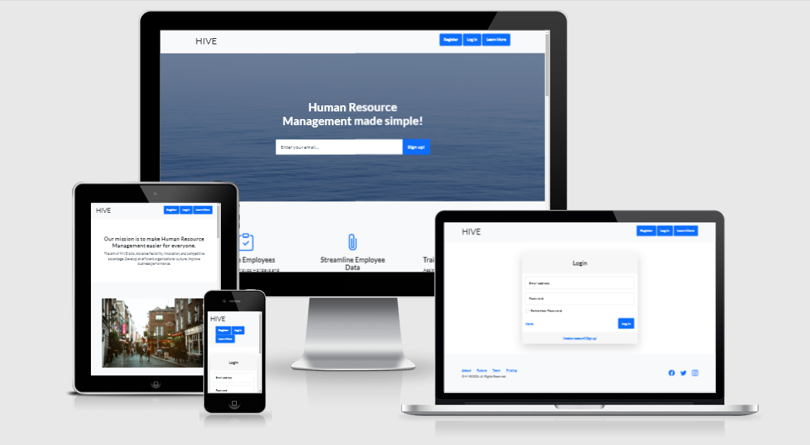

## Objective
This Website was created for the purpose of satisfying the criteria for the third Milestone Project (Python and Data Centric Development) as part of Code Institute's Full Stack Software Developer course.
The project features a full-stack website that allows users manage a collective dataset centered around a Human Resource domain. The website was constructed using HTML, CSS, Python, Flask and MongoDB.

## UX & Design

## Strategy

#### Project Goal
The primary goal or 'use case' of the website is to act as a platform where employees and Human Resource professionals of a company can store particular details relating to their employment. Such as, their personal details, contact information. Entitlements such as salary, bonus, position and number of holiday's they have. User's with Administrator level access will be able to assign, edit or remove tasks to employee's based on their email address, they will also be able to set the employees salary, bonus and number of holiday days.
General users can book days off which will be reflected in their total holiday days. they can edit their personal information and mark tasks as complete but they can not edit details about their salary, bonus, position and number of holiday's they have.

#### Ideation
The concept of a HR management platform came from my own experience working in a corporate environment where there was no real way for the HR department to interact with the employee's of the company, other than via email or physically visiting their office. 

#### Site owner goals
Developing this website will and has served as a learning experience. An introduction to using Flask with MongoDB to form my first full-stack website. I want the website to serve as a starting point for me to develop better full-stack websites and applications in the future

#### User goals
To have a collaborative platform where users can maintain personal, employment based data, allocate tasks and entitlements.

#### User Demographics
* HR professionals
* Small-Mid-Large companies
* Company employees

#### User requirements
* Intuitive interface
* Responsive on all form factors
* Easy to use and navigate

#### User Stories
As a general user:
* I would like to be able to register for an account.
* I would like to be able to log in to an existing account.
* I would like to be able to log out of an existing account.
* I would like to edit my personal details.
* I would like to book annual leave days.
* I would like to be able to view tasks assigned to me.
* I would like to be able to mark tasks assigned to me as complete.

As a administrative user:
* I would like to be able to register for an account.
* I would like to be able to log in to an existing account.
* I would like to be able to log out of an existing account.
* I would like to edit my personal details.
* I would like to book annual leave days.
* I would like to be able to view tasks assigned to me.
* I would like to be able to mark tasks assigned to me as complete.
* I would like to assign tasks to general users.
* I would like to edit tasks assigned to general users.
* I would like to edit entitlements of general users based on their position, bonus and salary.

#### Opportunities Matrix

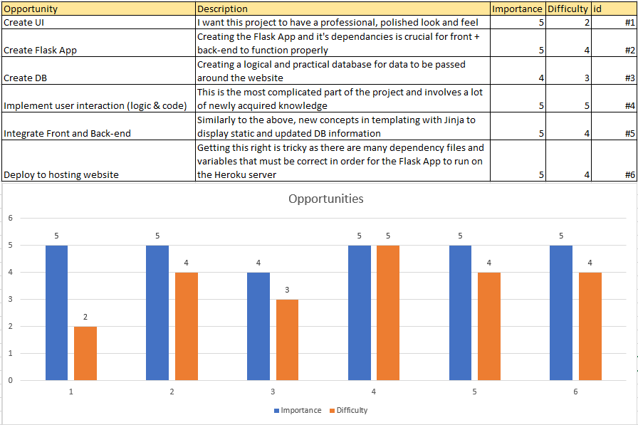

## Structure

### Current Features
#### Features common to all pages
* Navbar with navigation buttons
* Footer with links to the relevant sections on the info page
* social media icons

#### Landing page features
* A full width page banner descibes exactly what the website is aiming to achieve "Human Resource Management made simple!".
* within the banner there is a call to action for the site visitor to enter their email address to learn more.
* In the main body of the page there are distinct sections that highlight the benefits that HIVE can bring to your organisation.
* At the bottom of the page there is section with user success stories. 
* A further call to action sits under this to once again prompt the visitor to enter their email address.

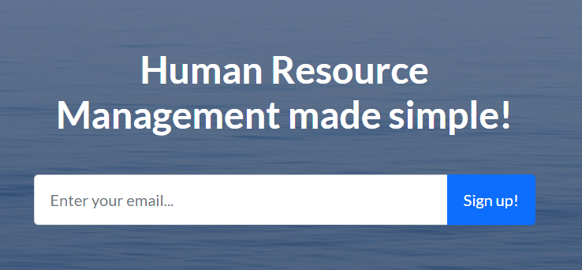

* If the user is not signed in or not registered, they will see the below navbar button group layout

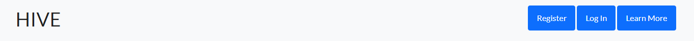

* If the user is signed in they will see the below button group

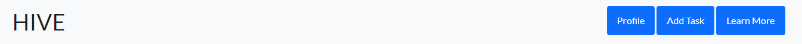

#### Registration page features
The registration page features a simple to understand form that collects the majority of the users details that are then displayed on their profile page.
* Importantly there is a switch that changes the type of account between general user and admin level access.
* There is a link at the bottom of the form for the user to navigate to the log in page if they already have an account.
 
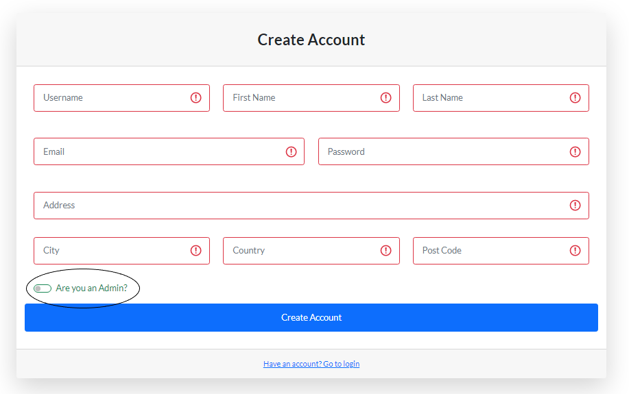

#### Log in page features
The Log in page is simple, clean and intuitive.
* The user logs in with their email address and password that were used at registration. 
* If the user does not have an account, there is a link at the bottom of the form for the user to navigate to the registration page.

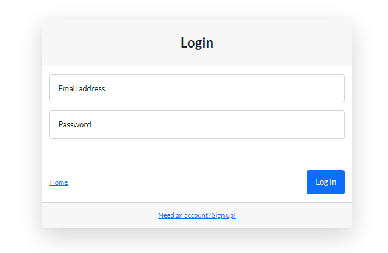

#### Profile page features
The Profile page contains the richest amount of content and features on the website. 
* The user is greeted with a pleasing layout and personal welcome message, which is slightly different depending if the account is general or admin level. 

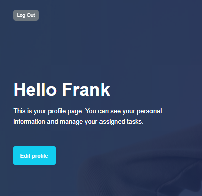

* There is a button for the user to log out of their account safely.
* There is a button for the user to edit their profile details.
* The main body of the profile page contains a variety of personal information about the person.

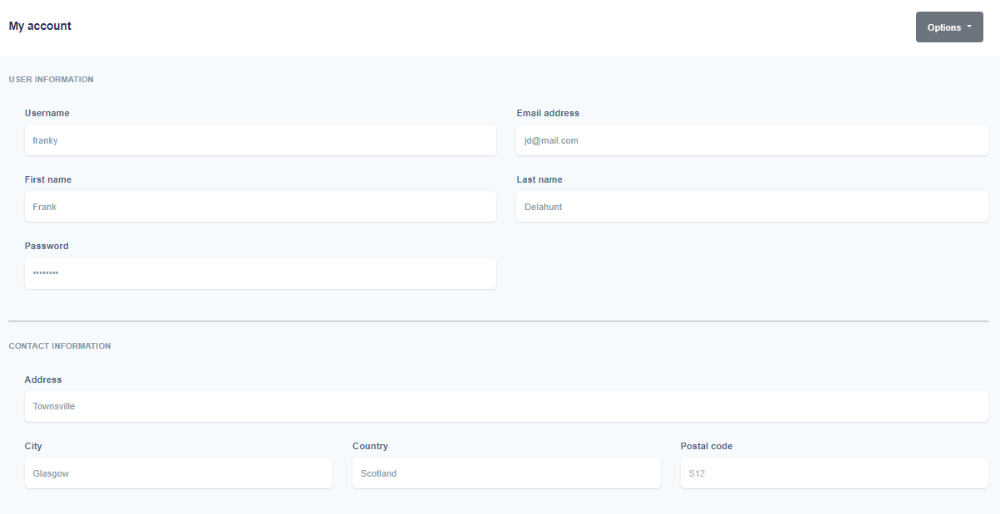

* In the current tasks section, active tasks assigned to or by (admin) the user will appear. 
* To view the details of the task the user clicks on the left button describing the task and an accordion drops down.
* Depending on the users access level, they will either see

(general user view)
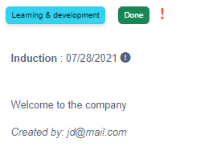

(admin user view)
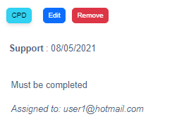

* The profile page will also display the users Salary, Bonus, Position and Holiday days left. 

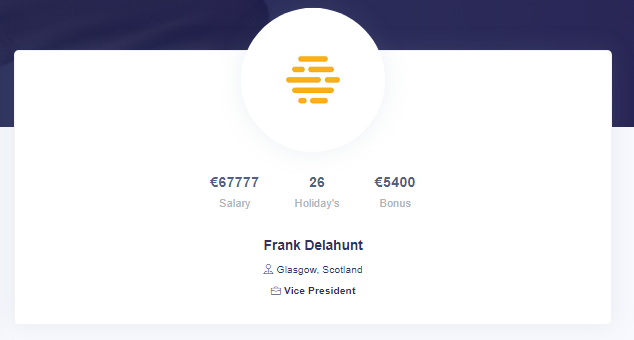

* These details are added by an **admin user only** based on the users email address, via the 'Edit Entitlements' link in the 'Options' dropdown.

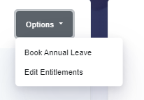

* Users have the option of booking annual leave days that will be deducted from their total (displayed on their profile). 
* To access this booking from they go via 'Book Annual Leave' in 'Options' same as above.

### Design Features

#### Colours
* The colour pallete of the website is mainly pale greys and blues to give a feeling of calm.
#### Typography
* Use of the Roboto font throughout for a professional look. 
#### Images
* Images included are of a business professional nature. To give a look of collaboration and synergy.  

## Skeleton
### Wireframes

* Landing page

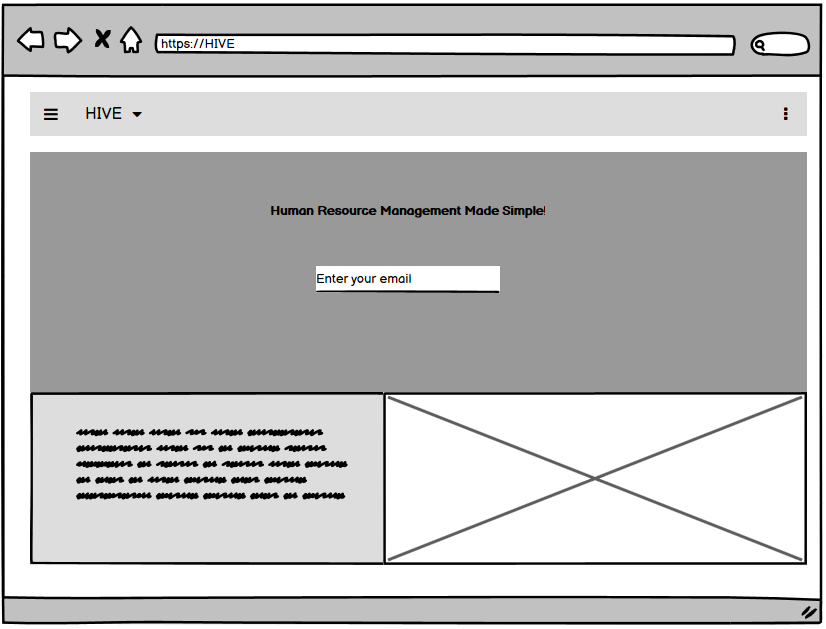

* Profile page

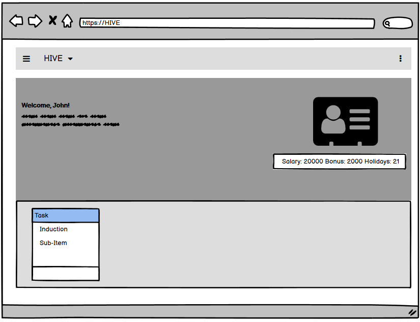

* Add Task

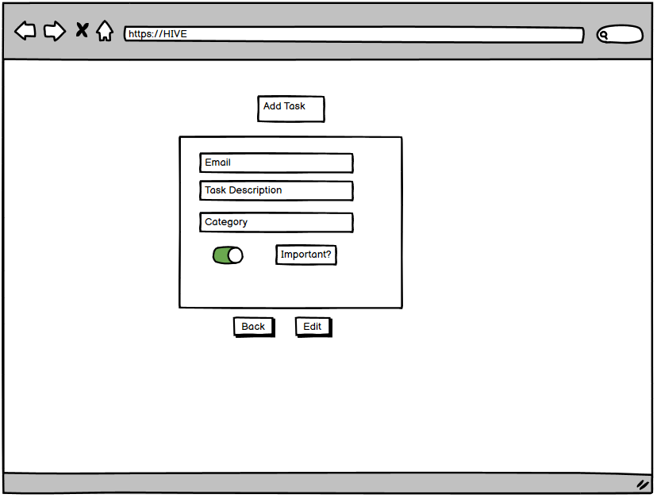

* Edit Profile

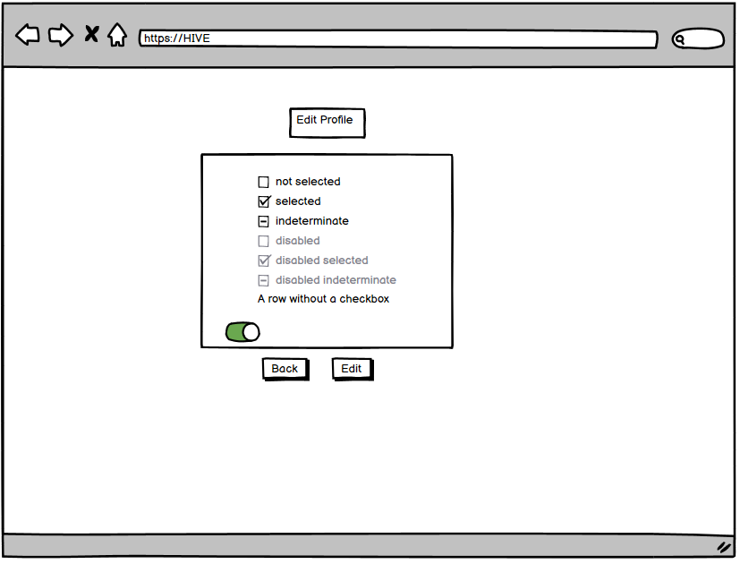

### Sitemap

* A general high level view of the website 

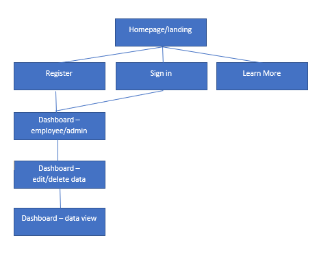

### Database Schema

* The database was set up in MongoDb as follows:

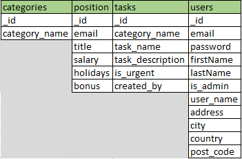

## Technologies used

This project some new technologies that I had not used before, namely Flask and MongoDB.
* HTML, CSS
* Bootstrap
* Bootstrap Icons
* Python
* Gitpod
* Github
* Git
* Google Fonts
* MongoDB
* Flask
* Jinja
* Temp Mail
* Balsamiq

## Deployment
The IDE used for the project was Gitpod, all code was committed and pushed to Github using Git version control.
As the project is fullstack, it was necessary to use a hosting platform that supported this functionality. Heroku was chosen for this reason.
The specific deployment method was to connect Github to Heroku and enable automatic deploys, so that every push to master will deploy a new version of this web app.

There are some essential set-up steps required before launching the app on Heroku.
* Firstly, in the IDE within the project directory, create a requirements.txt file for specifying what python packages are required to run the project. Typically the requirements.txt file is located in the root directory of the project.

The current 'state' packages are captured by running the following command in the terminal: pip freeze --local > requirements.txt

* Additionally, Heroku apps include a Procfile that specifies the commands that are executed by the app on startup.
* Push these files to GitHub and run the app.

### Initialising Heroku app
* Create Heroku account and sign in.
* Select 'New' button and 'Create new app'.
* Choose a name for the app in lowercase.
* Choose geographic region 'Europe' in this case.

### Setting global variables
Whatever variables are set in the env.py within the root directory must also be set in the Heroku app. Specifically, within settings chose 'Reveal config vars' and input the relevant pairs.

| Key  | Value |
| ------------- | ------------- |
| IP  | 0.0.0.0  |
| PORT  | 5000  |
| MONGO_DBNAME  | Name of DB  |
| MONGO_URI  | Generated within Heroku  |
| SECRET_KEY  | Password  |

The MONGO_URI value can be sourced from the DB cluster, Copy the link provided to the application and ensure the password and dbname are changed with the correct values).
The SECRET_KEY is set by the user and not committed to source control.

#### Enable automatic deploy
* Select Deploy tab
* Select enable Automatic deploys

#### Enable connection to GitHub Repo
* Select deploy tab
* Type repo name in search
* Select the dropdown beside GitHub button
* Select connect 

### Creating a Fork
* Navigate to GitHub
* While in GitHub select (https://github.com/devgithubs/HIVE/)
* In the top right-hand side of the page select 'Fork'

## Credits

#### Images
The images used throughout the website were sourced from (https://unsplash.com/) which provides free, high-resolution images.
#### Code
* The code snippets and templates were adapted from (https://startbootstrap.com/).
* Code Institute's Tim Nelson's mini project provided a lot of the inspiration for the creation of this site.

#### Acknowledgments
Special thanks you to Code Institute's tutor support team for their help throughout.
